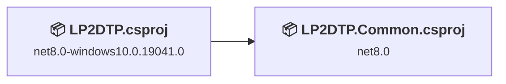
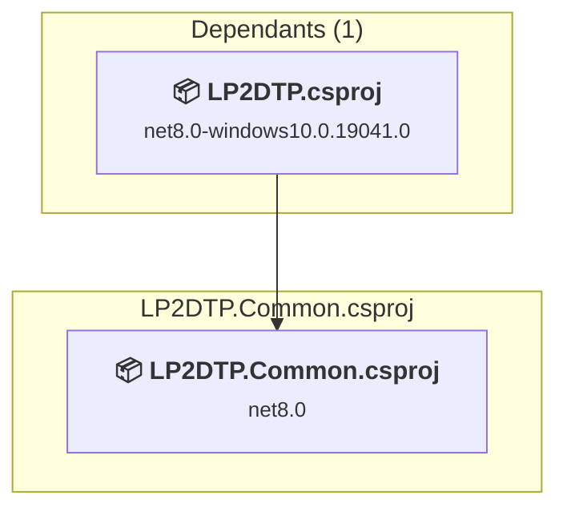
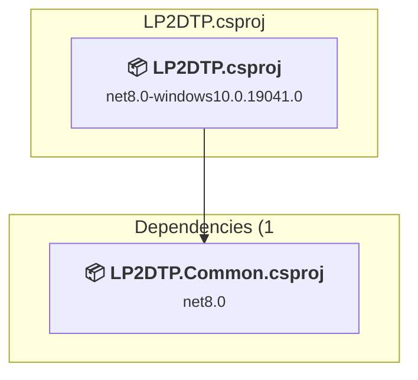

# Projects and dependencies analysis

This document provides a comprehensive overview of the projects and their dependencies in the context of upgrading to .NETCoreApp,Version=v10.0.

## Table of Contents

- [Executive Summary](#executive-Summary)
  - [Highlevel Metrics](#highlevel-metrics)
  - [Projects Compatibility](#projects-compatibility)
  - [Package Compatibility](#package-compatibility)
  - [API Compatibility](#api-compatibility)
- [Aggregate NuGet packages details](#aggregate-nuget-packages-details)
- [Top API Migration Challenges](#top-api-migration-challenges)
  - [Technologies and Features](#technologies-and-features)
  - [Most Frequent API Issues](#most-frequent-api-issues)
- [Projects Relationship Graph](#projects-relationship-graph)
- [Project Details](#project-details)

  - [LP2DTP.Common\LP2DTP.Common.csproj](#lp2dtpcommonlp2dtpcommoncsproj)
  - [LP2DTP\LP2DTP.csproj](#lp2dtplp2dtpcsproj)

## Executive Summary

### Highlevel Metrics

| Metric | Count | Status |
| :--- | :---: | :--- |
| Total Projects | 2 | All require upgrade |
| Total NuGet Packages | 2 | All compatible |
| Total Code Files | 11 |  |
| Total Code Files with Incidents | 4 |  |
| Total Lines of Code | 922 |  |
| Total Number of Issues | 44 |  |
| Estimated LOC to modify | 42+ | at least 4.6% of codebase |

### Projects Compatibility

| Project | Target Framework | Difficulty | Package Issues | API Issues | Est. LOC Impact | Description |
| :--- | :---: | :---: | :---: | :---: | :---: | :--- |
| [LP2DTP.Common\LP2DTP.Common.csproj](#lp2dtpcommonlp2dtpcommoncsproj) | net8.0 | 🟢 Low | 0 | 0 |  | ClassLibrary, Sdk Style = True |
| [LP2DTP\LP2DTP.csproj](#lp2dtplp2dtpcsproj) | net8.0-windows10.0.19041.0 | 🟢 Low | 0 | 42 | 42+ | WinForms, Sdk Style = True |

### Package Compatibility

| Status | Count | Percentage |
| :--- | :---: | :---: |
| ✅ Compatible | 2 | 100.0% |
| ⚠️ Incompatible | 0 | 0.0% |
| 🔄 Upgrade Recommended | 0 | 0.0% |
| ***Total NuGet Packages*** | ***2*** | ***100%*** |

### API Compatibility

| Category | Count | Impact |
| :--- | :---: | :--- |
| 🔴 Binary Incompatible | 0 | High - Require code changes |
| 🟡 Source Incompatible | 40 | Medium - Needs re-compilation and potential conflicting API error fixing |
| 🔵 Behavioral change | 2 | Low - Behavioral changes that may require testing at runtime |
| ✅ Compatible | 2163 |  |
| ***Total APIs Analyzed*** | ***2205*** |  |

## Aggregate NuGet packages details

| Package | Current Version | Suggested Version | Projects | Description |
| :--- | :---: | :---: | :--- | :--- |
| Microsoft.Windows.SDK.BuildTools | 10.0.26100.7705 |  | [LP2DTP.csproj](#lp2dtplp2dtpcsproj) | ✅Compatible |
| Microsoft.WindowsAppSDK | 1.8.260209005 |  | [LP2DTP.csproj](#lp2dtplp2dtpcsproj) | ✅Compatible |

## Top API Migration Challenges

### Technologies and Features

| Technology | Issues | Percentage | Migration Path |
| :--- | :---: | :---: | :--- |

### Most Frequent API Issues

| API | Count | Percentage | Category |
| :--- | :---: | :---: | :--- |
| P:Windows.UI.Color.B | 8 | 19.0% | Source Incompatible |
| P:Windows.UI.Color.G | 8 | 19.0% | Source Incompatible |
| P:Windows.UI.Color.R | 8 | 19.0% | Source Incompatible |
| P:Windows.UI.Color.A | 8 | 19.0% | Source Incompatible |
| T:Windows.UI.Color | 8 | 19.0% | Source Incompatible |
| T:System.Uri | 1 | 2.4% | Behavioral Change |
| M:System.Uri.#ctor(System.String) | 1 | 2.4% | Behavioral Change |

## Projects Relationship Graph

Legend:
📦 SDK-style project
⚙️ Classic project

## Project Details

### LP2DTP.Common\LP2DTP.Common.csproj

#### Project Info

- **Current Target Framework:** net8.0
- **Proposed Target Framework:** net10.0
- **SDK-style**: True
- **Project Kind:** ClassLibrary
- **Dependencies**: 0
- **Dependants**: 1
- **Number of Files**: 3
- **Number of Files with Incidents**: 1
- **Lines of Code**: 64
- **Estimated LOC to modify**: 0+ (at least 0.0% of the project)

#### Dependency Graph

Legend:
📦 SDK-style project
⚙️ Classic project

### API Compatibility

| Category | Count | Impact |
| :--- | :---: | :--- |
| 🔴 Binary Incompatible | 0 | High - Require code changes |
| 🟡 Source Incompatible | 0 | Medium - Needs re-compilation and potential conflicting API error fixing |
| 🔵 Behavioral change | 0 | Low - Behavioral changes that may require testing at runtime |
| ✅ Compatible | 22 |  |
| ***Total APIs Analyzed*** | ***22*** |  |

### LP2DTP\LP2DTP.csproj

#### Project Info

- **Current Target Framework:** net8.0-windows10.0.19041.0
- **Proposed Target Framework:** net10.0-windows10.0.22000.0
- **SDK-style**: True
- **Project Kind:** WinForms
- **Dependencies**: 1
- **Dependants**: 0
- **Number of Files**: 22
- **Number of Files with Incidents**: 3
- **Lines of Code**: 858
- **Estimated LOC to modify**: 42+ (at least 4.9% of the project)

#### Dependency Graph

Legend:
📦 SDK-style project
⚙️ Classic project

### API Compatibility

| Category | Count | Impact |
| :--- | :---: | :--- |
| 🔴 Binary Incompatible | 0 | High - Require code changes |
| 🟡 Source Incompatible | 40 | Medium - Needs re-compilation and potential conflicting API error fixing |
| 🔵 Behavioral change | 2 | Low - Behavioral changes that may require testing at runtime |
| ✅ Compatible | 2141 |  |
| ***Total APIs Analyzed*** | ***2183*** |  |

