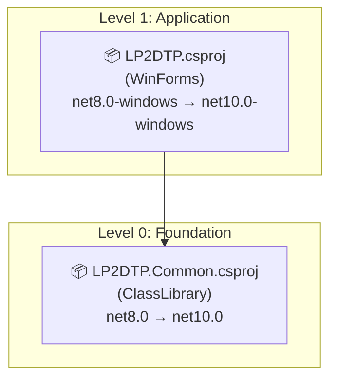

# .NET 10.0 Upgrade Plan

## Table of Contents

- [Executive Summary](#executive-summary)
- [Migration Strategy](#migration-strategy)
- [Detailed Dependency Analysis](#detailed-dependency-analysis)
- [Project-by-Project Plans](#project-by-project-plans)
  - [LP2DTP.Common](#lp2dtpcommon)
  - [LP2DTP](#lp2dtp)
- [Risk Management](#risk-management)
- [Testing & Validation Strategy](#testing--validation-strategy)
- [Complexity & Effort Assessment](#complexity--effort-assessment)
- [Source Control Strategy](#source-control-strategy)
- [Success Criteria](#success-criteria)

---

## Executive Summary

### Scenario Description
Upgrade LogPole2 solution from .NET 8.0 to .NET 10.0 (Long Term Support).

### Scope
**Projects Affected:** 2
- `LP2DTP.Common` (ClassLibrary) - net8.0 → net10.0
- `LP2DTP` (WinForms Application) - net8.0-windows10.0.19041.0 → net10.0-windows10.0.22000.0

### Current State
- Both projects currently targeting .NET 8.0
- 2 NuGet packages (Microsoft.Windows.SDK.BuildTools, Microsoft.WindowsAppSDK) - all compatible
- 922 total lines of code
- Simple dependency structure: LP2DTP → LP2DTP.Common

### Target State
- All projects targeting .NET 10.0 (LTS)
- Windows SDK version updated from 10.0.19041.0 to 10.0.22000.0 for WinForms project
- All API compatibility issues resolved
- Solution builds and runs successfully on .NET 10.0

### Selected Strategy
**All-At-Once Strategy** - All projects upgraded simultaneously in single atomic operation.

**Rationale:**
- Small solution (2 projects only)
- Simple, linear dependency structure (depth = 1)
- All packages already compatible with .NET 10.0
- Small codebase (922 LOC total)
- No security vulnerabilities or critical blocking issues
- Clean upgrade path with predictable API changes

### Discovered Metrics
- **Projects:** 2
- **Dependencies:** 1 (LP2DTP depends on LP2DTP.Common)
- **NuGet Packages:** 2 (100% compatible)
- **Code Files:** 11 (4 with API compatibility issues)
- **Total LOC:** 922
- **Estimated LOC Impact:** 42+ lines (4.6% of codebase)
- **API Issues:** 42 total
  - 40 Source Incompatible (Windows.UI.Color usage)
  - 2 Behavioral Changes (System.Uri constructor)

### Complexity Classification
**Simple Solution** - Fast batch approach suitable.

**Justification:**
- ≤5 projects ✓
- Depth ≤2 ✓
- No high-risk issues ✓
- No security vulnerabilities ✓
- Homogeneous codebase ✓

### Critical Issues
- **Windows.UI.Color API Changes:** 40 instances of source incompatibility due to namespace/type changes in .NET 10.0
- **System.Uri Behavioral Change:** Uri parsing behavior change may affect 1 usage in LP2DTP project

### Recommended Approach
All-At-Once upgrade with single atomic operation covering both projects simultaneously.

### Expected Iterations
- **Phase 1:** Discovery & Classification (3 iterations) ✓
- **Phase 2:** Foundation (3 iterations) 
- **Phase 3:** Dynamic Detail Generation (1-2 iterations for simple solution)
- **Total:** 7-8 iterations

---

## Migration Strategy

### Approach Selection

**Selected Strategy: All-At-Once Strategy**

All projects in the solution will be upgraded simultaneously in a single coordinated operation.

### Justification

**Why All-At-Once is optimal for this solution:**

1. **Small Solution Size**
   - Only 2 projects (well below 30-project threshold)
   - 922 total lines of code
   - Simple to manage in single operation

2. **Simple Dependency Structure**
   - Linear dependency chain (depth = 1)
   - No circular dependencies
   - Clear foundation → application flow

3. **Homogeneous Technology Stack**
   - Both projects on .NET 8.0
   - Both moving to .NET 10.0
   - Consistent upgrade path

4. **Low External Dependency Complexity**
   - Only 2 NuGet packages
   - Both packages already compatible (no updates required)
   - No breaking package changes

5. **Manageable Risk Profile**
   - No security vulnerabilities
   - API issues isolated to single namespace (Windows.UI.Color)
   - Predictable breaking changes
   - Small impact surface (4.6% of codebase)

6. **Execution Efficiency**
   - Fastest completion time
   - No multi-targeting complexity
   - Single testing cycle
   - Clean dependency resolution

### All-At-Once Strategy Rationale

**Benefits for this solution:**
- ✅ Complete upgrade in single operation
- ✅ All projects benefit simultaneously
- ✅ No intermediate compatibility states
- ✅ Simplified testing (one comprehensive test cycle)
- ✅ Faster time to completion
- ✅ Clean source control history (single atomic commit)

**Mitigation of All-At-Once risks:**
- Small codebase reduces "big bang" risk
- Clear API issues identified in advance
- Comprehensive testing plan in place
- Rollback strategy available (git revert if no git repo, backup otherwise)

### Dependency-Based Ordering

**Even in All-At-Once strategy, respect dependency order for validation:**

1. **Foundation (Level 0):** LP2DTP.Common
   - Update project file
   - Build and validate (no API issues expected)

2. **Application (Level 1):** LP2DTP
   - Update project file
   - Build and identify compilation errors
   - Fix Windows.UI.Color API issues
   - Address System.Uri behavioral change
   - Rebuild and validate

**Atomic Operation Sequence:**
```
1. Update both .csproj files (TargetFramework properties)
   ├─ LP2DTP.Common: net8.0 → net10.0
   └─ LP2DTP: net8.0-windows10.0.19041.0 → net10.0-windows10.0.22000.0

2. Restore dependencies
   └─ dotnet restore

3. Build in dependency order
   ├─ Build LP2DTP.Common (expect success)
   └─ Build LP2DTP (expect API errors)

4. Fix compilation errors
   └─ Address Windows.UI.Color namespace changes (40 instances)
   └─ Review System.Uri usage (2 instances)

5. Final validation
   ├─ Build entire solution
   └─ Verify 0 errors, 0 warnings
```

### Parallel vs Sequential Execution

**Sequential execution within atomic operation:**
- Projects built in dependency order for clear error identification
- Foundation validated before application changes
- Errors isolated to specific project scope

**No parallel execution needed:**
- Only 2 projects (minimal coordination overhead)
- Sequential approach provides clearer troubleshooting
- Build time is negligible for small solution

### Phase Definitions

**Phase 0: Preparation**
- Validate .NET 10.0 SDK installed
- Create backup (no git repository detected)

**Phase 1: Atomic Upgrade** (Single coordinated operation)
- Update all project files
- Build and fix all compilation errors
- Full solution validation

**Phase 2: Testing & Validation**
- Smoke test application launch
- Functional testing of Windows.UI.Color dependent features
- System.Uri behavior validation

### Risk Management During Execution

**Continuous monitoring during atomic operation:**
- [ ] LP2DTP.Common builds after framework update (expected: success)
- [ ] LP2DTP compilation errors match predicted API issues (expected: Windows.UI.Color)
- [ ] No unexpected breaking changes appear
- [ ] Solution builds with 0 errors after fixes

**Abort conditions:**
- Unexpected breaking changes beyond Windows.UI.Color and System.Uri
- Build failures in LP2DTP.Common (should have zero issues)
- Package compatibility issues (unexpected, all marked compatible)

### Alternative Approach Considered

**Incremental Migration (Rejected):**
- Would involve migrating LP2DTP.Common first, then LP2DTP
- **Rejected because:** Unnecessary complexity for 2-project solution
- **Adds overhead:** Multi-targeting, intermediate testing, longer timeline
- **No benefit:** Risk profile doesn't justify incremental approach

---

## Detailed Dependency Analysis

### Dependency Graph Summary

The solution has a simple, linear dependency structure with two levels:

```
Level 0 (Foundation - no project dependencies):
  └─ LP2DTP.Common.csproj (ClassLibrary)
      └─ Used by: LP2DTP

Level 1 (Application - depends on Level 0):
  └─ LP2DTP.csproj (WinForms Application)
      └─ Depends on: LP2DTP.Common
      └─ Used by: (none - top level application)
```

**Mermaid Diagram:**


### Project Groupings by Migration Phase

**All-At-Once Strategy dictates single atomic upgrade phase:**

**Phase 1: Atomic Upgrade** (All projects simultaneously)
- LP2DTP.Common (no project dependencies, 0 API issues)
- LP2DTP (depends on LP2DTP.Common, 42 API issues)

**Rationale for simultaneous upgrade:**
- Both projects must target compatible frameworks for solution coherence
- LP2DTP.Common has zero API issues, making it safe to upgrade
- LP2DTP's 42 API issues are isolated to Windows.UI.Color namespace usage
- No circular dependencies or complex interdependencies
- Small codebase enables comprehensive testing after single upgrade operation

### Critical Path Identification

**Critical Path:** LP2DTP.Common → LP2DTP

**Key Considerations:**
1. **LP2DTP.Common** is the foundation library with no dependencies
   - Zero API compatibility issues
   - Safe to upgrade first in dependency order
   - Must build successfully before LP2DTP can be validated

2. **LP2DTP** is the main WinForms application
   - All 42 API issues are in this project
   - Depends on LP2DTP.Common
   - Requires Windows.UI.Color namespace migration
   - Must address System.Uri behavioral change

**Migration Order (within atomic operation):**
1. Update both project files simultaneously
2. Build LP2DTP.Common first (validates foundation)
3. Build LP2DTP (validates application and API changes)
4. Fix compilation errors in dependency order
5. Run full solution build

### Circular Dependency Analysis

**Status:** No circular dependencies detected ✓

The dependency graph is acyclic with a clear foundation-to-application flow.

### Dependency Metadata

| Project | Dependencies | Dependents | Package Count | Issues | LOC |
|---------|-------------|-----------|---------------|---------|-----|
| LP2DTP.Common | 0 | 1 | 0 | 1 | 64 |
| LP2DTP | 1 | 0 | 2 | 43 | 858 |

### External Dependencies

**NuGet Packages:**
- Microsoft.Windows.SDK.BuildTools 10.0.26100.7705 (✅ Compatible)
- Microsoft.WindowsAppSDK 1.8.260209005 (✅ Compatible)

**No package updates required** - both packages are compatible with .NET 10.0.

---

## Project-by-Project Plans

### LP2DTP.Common

**Project Type:** ClassLibrary (SDK-style)

**Current State:**
- Target Framework: net8.0
- Dependencies: 0 project references, 0 NuGet packages
- Dependents: LP2DTP (1 project)
- Files: 3 code files
- Lines of Code: 64
- API Issues: 0

**Target State:**
- Target Framework: net10.0
- No package updates required
- Expected: Zero compilation errors

#### Migration Steps

**1. Prerequisites**
- ✅ No project dependencies (foundation library)
- ✅ No NuGet package dependencies
- ✅ .NET 10.0 SDK installed

**2. Framework Update**

Update `LP2DTP.Common\LP2DTP.Common.csproj`:

```xml
<TargetFramework>net10.0</TargetFramework>
```

**Change:** `net8.0` → `net10.0`

**3. Package Updates**

**None required** - Project has no NuGet package dependencies.

**4. Expected Breaking Changes**

**None** - Assessment identified zero API compatibility issues in this project.

**5. Code Modifications**

**None expected** - No API changes affect this project.

**Steps:**
1. Update TargetFramework in project file
2. Save project file
3. Restore dependencies (if any added in future)

**6. Testing Strategy**

**Build Validation:**
- Build LP2DTP.Common project individually
- Verify 0 errors, 0 warnings
- Confirm successful compilation on .NET 10.0

**Dependency Validation:**
- Verify LP2DTP project can still reference LP2DTP.Common
- Confirm no dependency resolution issues

**No Unit Tests Identified** - Manual validation via dependent project (LP2DTP).

**7. Validation Checklist**

- [ ] Project file updated to net10.0
- [ ] `dotnet restore` completes successfully
- [ ] `dotnet build` completes with 0 errors
- [ ] `dotnet build` completes with 0 warnings
- [ ] LP2DTP can reference updated LP2DTP.Common
- [ ] No runtime exceptions when LP2DTP uses Common types

#### Risk Assessment

**Risk Level: 🟢 Low**

**Rationale:**
- Zero API compatibility issues
- No dependencies to manage
- Simple framework version update only
- No code changes required

**Confidence: Very High** - Straightforward framework upgrade with no complications.

---

### LP2DTP

**Project Type:** WinForms Application (SDK-style)

**Current State:**
- Target Framework: net8.0-windows10.0.19041.0
- Dependencies: 1 project (LP2DTP.Common), 2 NuGet packages
- Dependents: None (top-level application)
- Files: 22 code files (3 with API issues)
- Lines of Code: 858
- API Issues: 42 total
  - 40 Source Incompatible (Windows.UI.Color)
  - 2 Behavioral Changes (System.Uri)
- Estimated LOC Impact: 42+ lines (4.9% of project)

**Target State:**
- Target Framework: net10.0-windows10.0.22000.0
- No package updates required
- Windows.UI.Color API changes resolved
- System.Uri behavioral changes validated

#### Migration Steps

**1. Prerequisites**
- ✅ LP2DTP.Common upgraded to net10.0 (dependency)
- ✅ .NET 10.0 SDK installed
- ✅ Windows SDK 10.0.22000.0 or higher available

**2. Framework Update**

Update `LP2DTP\LP2DTP.csproj`:

```xml
<TargetFramework>net10.0-windows10.0.22000.0</TargetFramework>
```

**Changes:**
- Framework: `net8.0-windows10.0.19041.0` → `net10.0-windows10.0.22000.0`
- Windows SDK: 10.0.19041.0 (Windows 10 2004) → 10.0.22000.0 (Windows 11)

**3. Package Updates**

**None required** - Both packages are already compatible:

| Package | Current Version | Status |
|---------|----------------|---------|
| Microsoft.Windows.SDK.BuildTools | 10.0.26100.7705 | ✅ Compatible |
| Microsoft.WindowsAppSDK | 1.8.260209005 | ✅ Compatible |

**4. Expected Breaking Changes**

#### 4.1 Windows.UI.Color API (40 instances) - **PRIMARY ISSUE**

**Problem:** `Windows.UI.Color` type is source incompatible in .NET 10.0.

**Affected Files:**
- `LP2DTP\VisaItemListContent.cs` (all 40 instances in this file)

**Affected Lines:**
- Line 184: Delete button background color
- Line 227: Button background color
- Line 327: Conditional error/success color (2 instances)

**Current Usage Pattern:**
```csharp
new Windows.UI.Color { A = 255, R = 255, G = 0, B = 0 }
```

**Migration Options:**

**Option A: System.Drawing.Color (Recommended for WinForms)**
```csharp
// Add using directive
using System.Drawing;

// Replace Windows.UI.Color with System.Drawing.Color
System.Drawing.Color.FromArgb(255, 255, 0, 0)

// For SolidColorBrush, may need conversion helper
```

**Option B: Windows.UI.Xaml.Media.Color (WinUI/UWP path)**
```csharp
// Add using directive
using Windows.UI.Xaml.Media;

// Use Xaml Media color
Windows.UI.Xaml.Media.Color.FromArgb(255, 255, 0, 0)
```

**Option C: Microsoft.UI.Xaml.Media.Color (WinUI 3 / WindowsAppSDK)**
```csharp
// Add using directive
using Microsoft.UI.Xaml.Media;

// Use WinUI 3 color
Microsoft.UI.Xaml.Media.Color.FromArgb(255, 255, 0, 0)
```

**Recommended Approach:** Option C (Microsoft.UI.Xaml.Media.Color)
- Aligns with Microsoft.WindowsAppSDK package already in use
- Modern WinUI 3 path forward
- Compatible with .NET 10.0

**Specific Replacements Required:**

1. **Line 184 - Delete Button:**
```csharp
// Current
Background = new SolidColorBrush(new Windows.UI.Color { A = 255, R = 244, G = 67, B = 54 })

// Replace with
Background = new SolidColorBrush(Microsoft.UI.Xaml.Media.Color.FromArgb(255, 244, 67, 54))
```

2. **Line 227 - Button Background:**
```csharp
// Current
button.Background = new SolidColorBrush(new Windows.UI.Color { A = 255, R = 0, G = 128, B = 0 });

// Replace with
button.Background = new SolidColorBrush(Microsoft.UI.Xaml.Media.Color.FromArgb(255, 0, 128, 0));
```

3. **Line 327 - Conditional Color:**
```csharp
// Current
var color = isError 
    ? new Windows.UI.Color { A = 255, R = 255, G = 0, B = 0 }
    : new Windows.UI.Color { A = 255, R = 0, G = 128, B = 0 };

// Replace with
var color = isError 
    ? Microsoft.UI.Xaml.Media.Color.FromArgb(255, 255, 0, 0)
    : Microsoft.UI.Xaml.Media.Color.FromArgb(255, 0, 128, 0);
```

**Required Using Statement:**
```csharp
using Microsoft.UI.Xaml.Media;
```

#### 4.2 System.Uri Behavioral Change (2 instances) - **LOW RISK**

**Problem:** Uri constructor behavior changed in .NET 10.0.

**Impact:** Runtime behavior change without compilation errors.

**Mitigation:**
1. Identify System.Uri usage in project (assessment shows 2 instances)
2. Review Uri parsing logic for:
   - URI validation changes
   - Parsing behavior differences
   - Exception handling changes
3. Test all URI-related functionality thoroughly

**Action Items:**
- [ ] Locate 2 System.Uri usages in LP2DTP project
- [ ] Review construction context (what URIs are being created)
- [ ] Add explicit validation if needed
- [ ] Test URI parsing scenarios

**5. Code Modifications**

**Step-by-Step Process:**

1. **Add Required Using Directive** to `VisaItemListContent.cs`:
```csharp
using Microsoft.UI.Xaml.Media;
```

2. **Remove Old Using Directive** (if present):
```csharp
// Remove or comment out:
// using Windows.UI;
```

3. **Find and Replace Windows.UI.Color Usage** (40 instances):
   - **Find:** `new Windows.UI.Color { A = (\d+), R = (\d+), G = (\d+), B = (\d+) }`
   - **Replace:** `Microsoft.UI.Xaml.Media.Color.FromArgb($1, $2, $3, $4)`
   - Use regex find/replace in IDE for efficiency

4. **Manual Verification**:
   - Review each replacement for correctness
   - Ensure argument order (A, R, G, B) is preserved
   - Verify SolidColorBrush calls remain valid

5. **Address System.Uri Behavioral Change**:
   - Search project for `new System.Uri(` or `new Uri(`
   - Review each instance for:
     - Hard-coded vs dynamic URIs
     - Error handling around Uri construction
     - URI format validation
   - Add try-catch or validation if appropriate

**6. Testing Strategy**

#### Build Testing
- [ ] Build LP2DTP project after framework update (expect 40+ errors)
- [ ] Build LP2DTP project after color API fixes (expect 0 errors)
- [ ] Build entire solution (expect 0 errors, 0 warnings)

#### Functional Testing

**Color-Related Features:**
- [ ] Launch application successfully
- [ ] Verify Delete button renders with correct red color (244, 67, 54)
- [ ] Verify action button renders with correct green color (0, 128, 0)
- [ ] Verify conditional error/success colors display correctly
- [ ] Check for any visual color rendering issues

**URI-Related Features:**
- [ ] Test any functionality involving URI construction
- [ ] Verify no Uri parsing exceptions at runtime
- [ ] Validate expected URI formats are handled correctly

**General Application Testing:**
- [ ] Application launches without errors
- [ ] Main window displays correctly
- [ ] VISA device functionality works (VisaItemListContent)
- [ ] No runtime exceptions in error logs
- [ ] Memory usage normal (no color-related leaks)

#### Integration Testing
- [ ] LP2DTP successfully uses LP2DTP.Common types
- [ ] No dependency resolution warnings
- [ ] Both projects target compatible frameworks

**7. Validation Checklist**

#### Pre-Build
- [ ] Project file updated to net10.0-windows10.0.22000.0
- [ ] LP2DTP.Common dependency upgraded to net10.0
- [ ] Using directive for Microsoft.UI.Xaml.Media added
- [ ] All 40 Windows.UI.Color instances replaced

#### Post-Build
- [ ] `dotnet restore` completes successfully
- [ ] `dotnet build` completes with 0 errors
- [ ] `dotnet build` completes with 0 warnings
- [ ] No package dependency conflicts
- [ ] Application executable created successfully

#### Runtime
- [ ] Application launches without exceptions
- [ ] UI renders correctly (colors display as expected)
- [ ] VISA device features functional
- [ ] No Uri parsing errors observed
- [ ] No performance degradation
- [ ] Error handling works as expected

#### Risk Assessment

**Risk Level: 🟡 Medium**

**Rationale:**
- 42 API issues concentrated in single file
- Color API migration path well-defined
- WinForms + WindowsAppSDK alignment required
- Behavioral change requires runtime validation

**Mitigation:**
- Issues pre-identified and cataloged
- Clear migration path to Microsoft.UI.Xaml.Media
- Small impact surface (4.9% of project)
- Systematic replacement approach (find/replace)

**Confidence: High** - API changes predictable, clear resolution path available.

---

## Risk Management

### High-Level Risk Assessment

**Overall Solution Risk: 🟢 Low**

**Risk Factors:**
- ✅ Small solution (2 projects)
- ✅ All packages compatible
- ✅ No security vulnerabilities
- ✅ Simple dependency structure
- ⚠️ 42 API compatibility issues (manageable, isolated)
- ✅ Small codebase impact (4.6%)

### Project Risk Levels

| Project | Risk Level | Description | Mitigation |
|---------|-----------|-------------|------------|
| LP2DTP.Common | 🟢 Low | No API issues, no dependencies, 64 LOC | Build first to validate foundation |
| LP2DTP | 🟡 Medium | 42 API issues, Windows.UI.Color migration | Pre-identified issues, clear resolution path |

### High-Risk Changes

#### 1. Windows.UI.Color API Migration (Medium Risk)

**Description:** 40 instances of Windows.UI.Color usage need migration
- Properties: Color.R, Color.G, Color.B, Color.A (8 instances each)
- Type usage: Windows.UI.Color type references (8 instances)

**Risk:** Source incompatibility causing compilation failures

**Mitigation:**
- Issues pre-identified in assessment
- Likely migration path: Windows.UI.Color → System.Drawing.Color or Windows.UI.Xaml.Media.Color
- Isolated to LP2DTP project only
- Can be fixed systematically (search and replace pattern)

**Validation:**
- Compilation success after fix
- Visual validation of color-dependent UI features
- No runtime color rendering issues

#### 2. System.Uri Behavioral Change (Low Risk)

**Description:** Uri constructor behavior change in .NET 10.0 (2 instances)
- Constructor: `System.Uri(string)`
- May affect URI parsing or validation logic

**Risk:** Runtime behavior change without compilation errors

**Mitigation:**
- Review all System.Uri usage in LP2DTP project
- Test URI parsing scenarios
- Validate expected URI formats still work

**Validation:**
- Unit tests for URI parsing (if present)
- Manual testing of features using URIs
- Verify no URI parsing exceptions at runtime

### Security Vulnerabilities

**Status:** ✅ No security vulnerabilities detected

Both NuGet packages (Microsoft.Windows.SDK.BuildTools, Microsoft.WindowsAppSDK) are up-to-date and have no known vulnerabilities.

### Contingency Plans

#### If Windows.UI.Color migration is more complex than expected:

**Option 1:** Add compatibility layer
- Create extension methods to bridge old/new Color APIs
- Gradual migration with adapter pattern

**Option 2:** Use different color representation
- Evaluate System.Drawing.Color compatibility
- Consider Windows.UI.Xaml.Media.Color as alternative

**Option 3:** Defer color-related features
- Comment out problematic code temporarily
- Complete core framework upgrade first
- Address color issues in follow-up phase

#### If unexpected breaking changes appear:

**Identification:**
- Additional API changes not in assessment
- New compilation errors beyond predicted
- Runtime exceptions after upgrade

**Response:**
1. Document new issue with context
2. Search Microsoft docs for .NET 10.0 breaking changes
3. Check GitHub issues for similar problems
4. Implement targeted fix or workaround
5. Update this plan with new findings

#### If build fails after framework update:

**Diagnostic Steps:**
1. Verify .NET 10.0 SDK properly installed
2. Check project file syntax (valid XML, correct TFM)
3. Clear bin/obj folders and retry
4. Restore packages explicitly (dotnet restore)
5. Build projects individually to isolate failure

**Recovery:**
- Rollback to .NET 8.0 (restore from backup)
- Investigate specific error messages
- Apply fixes incrementally
- Retry atomic upgrade once resolved

### Rollback Strategy

**No Git Repository Detected** - Manual backup approach:

**Before starting upgrade:**
1. Create full solution backup (zip archive with timestamp)
2. Note current SDK version
3. Document current build/test status

**Rollback procedure if needed:**
1. Stop all builds and close IDE
2. Delete modified solution folder
3. Restore from backup archive
4. Verify solution builds on .NET 8.0
5. Document rollback reason for future attempt

**Rollback triggers:**
- Unexpected breaking changes requiring research
- Build failures that cannot be resolved quickly
- Critical runtime issues discovered in testing
- Project timeline constraints require deferring upgrade

---

## Testing & Validation Strategy

### Multi-Level Testing Approach

This upgrade follows a layered testing strategy aligned with All-At-Once atomic operation:

1. **Per-Project Testing** - Validate each project individually after framework update
2. **Integration Testing** - Verify project-to-project dependencies work correctly
3. **Full Solution Testing** - Comprehensive end-to-end validation

---

### Phase 1: Atomic Upgrade Testing

#### LP2DTP.Common Testing

**Objective:** Verify foundation library builds successfully on .NET 10.0

**Build Validation:**
```bash
cd LP2DTP.Common
dotnet restore
dotnet build --configuration Release
```

**Expected Results:**
- ✅ Restore completes without errors
- ✅ Build completes with 0 errors
- ✅ Build completes with 0 warnings
- ✅ Output DLL created successfully

**Validation Checklist:**
- [ ] Project file TargetFramework = net10.0
- [ ] No package dependency warnings
- [ ] Build output shows .NET 10.0 runtime
- [ ] Assembly targets correct framework

**Abort Criteria:**
- ❌ Build fails (unexpected - no API issues predicted)
- ❌ New warnings appear
- ❌ Dependency resolution fails

---

#### LP2DTP Testing

**Objective:** Verify WinForms application builds after API fixes

**Build Validation (Pre-Fixes):**
```bash
cd LP2DTP
dotnet restore
dotnet build --configuration Release
```

**Expected Results (Before Fixes):**
- ⚠️ Restore completes
- ❌ Build fails with ~40 errors (Windows.UI.Color)
- ✅ Errors match predicted API issues

**Build Validation (Post-Fixes):**
```bash
dotnet build --configuration Release --no-restore
```

**Expected Results (After Fixes):**
- ✅ Build completes with 0 errors
- ✅ Build completes with 0 warnings
- ✅ Executable created successfully

**Validation Checklist:**
- [ ] Project file TargetFramework = net10.0-windows10.0.22000.0
- [ ] All 40 Windows.UI.Color instances replaced
- [ ] Using directive for Microsoft.UI.Xaml.Media added
- [ ] No compilation errors related to color APIs
- [ ] LP2DTP.Common reference resolves correctly
- [ ] Both NuGet packages restore successfully

**Abort Criteria:**
- ❌ Unexpected API errors beyond Windows.UI.Color/System.Uri
- ❌ Package compatibility issues (should be compatible)
- ❌ LP2DTP.Common reference fails

---

### Phase 2: Comprehensive Testing

#### Full Solution Build Testing

**Objective:** Verify entire solution builds cohesively

**Build Command:**
```bash
cd <solution root>
dotnet restore LogPole2.slnx
dotnet build LogPole2.slnx --configuration Release
```

**Expected Results:**
- ✅ All 2 projects build successfully
- ✅ 0 errors across entire solution
- ✅ 0 warnings across entire solution
- ✅ No dependency conflicts
- ✅ Correct framework targets for all projects

**Validation Checklist:**
- [ ] Solution restores without errors
- [ ] All projects target .NET 10.0
- [ ] No multi-targeting warnings
- [ ] Build output shows .NET 10.0 for all projects
- [ ] No package downgrade warnings

---

#### Smoke Testing

**Objective:** Quick validation that application launches and core functionality works

**Test Steps:**
1. **Launch Application**
   ```bash
   cd LP2DTP\bin\Release\net10.0-windows10.0.22000.0
   .\LP2DTP.exe
   ```
   - ✅ Application launches without exceptions
   - ✅ Main window displays correctly
   - ✅ No startup errors in logs

2. **Visual Inspection**
   - ✅ UI renders correctly (no missing elements)
   - ✅ Colors display as expected (red delete button, green action buttons)
   - ✅ Fonts and layout correct
   - ✅ No visual glitches or rendering issues

3. **Basic Interaction**
   - ✅ Window can be moved/resized
   - ✅ Buttons respond to clicks
   - ✅ No UI freezing or hangs

**Abort Criteria:**
- ❌ Application fails to launch
- ❌ Unhandled exceptions during startup
- ❌ Critical UI rendering failures

---

#### Functional Testing

**Objective:** Validate color-dependent and URI-dependent features work correctly

**Color API Testing (VisaItemListContent features):**

1. **Delete Button Color Validation**
   - Action: Locate delete button in VisaItemListContent
   - Expected: Red background (RGB: 244, 67, 54)
   - Verify: Color renders correctly, no missing background

2. **Action Button Color Validation**
   - Action: Locate action buttons (line 227 context)
   - Expected: Green background (RGB: 0, 128, 0)
   - Verify: Color renders correctly

3. **Conditional Error/Success Colors**
   - Action: Trigger error condition (line 327 context)
   - Expected: Red color (RGB: 255, 0, 0)
   - Action: Trigger success condition
   - Expected: Green color (RGB: 0, 128, 0)
   - Verify: Both conditions display correct colors

4. **SolidColorBrush Functionality**
   - Verify: All SolidColorBrush calls work with new Microsoft.UI.Xaml.Media.Color
   - Verify: No color rendering artifacts
   - Verify: Colors match original .NET 8.0 behavior

**System.Uri Behavioral Change Testing:**

1. **Locate Uri Usage**
   - Search project for System.Uri constructor calls
   - Identify context (what URIs are being created)

2. **Uri Parsing Validation**
   - Test: Create Uri instances with expected input formats
   - Verify: No parsing exceptions
   - Verify: Uri properties (Scheme, Host, Path) correct

3. **Edge Cases**
   - Test: Invalid URI formats (if applicable)
   - Verify: Error handling works as expected
   - Verify: No behavior regression from .NET 8.0

**VISA Device Functionality:**
- [ ] VISA device list displays correctly
- [ ] Can add/remove VISA items
- [ ] Polling device information accessible
- [ ] Commands execute (if testable)
- [ ] No exceptions in VISA-related code

---

#### Integration Testing

**Objective:** Verify LP2DTP and LP2DTP.Common work together correctly

**Test Cases:**

1. **Type Usage from LP2DTP.Common**
   - Verify: LP2DTP can instantiate Common types (e.g., VisaItem, PollingItem)
   - Verify: No type load exceptions
   - Verify: Properties accessible and functional

2. **Cross-Project References**
   - Verify: LP2DTP.Common types visible in LP2DTP
   - Verify: No namespace resolution issues
   - Verify: IntelliSense works for Common types

3. **Runtime Type Compatibility**
   - Verify: No version mismatch errors at runtime
   - Verify: Serialization/deserialization works (if applicable)
   - Verify: Type casting succeeds

---

#### Performance Testing (Optional)

**Objective:** Ensure no performance degradation from .NET 8.0 to 10.0

**Test Cases:**
- Application startup time (compare to .NET 8.0 baseline)
- Memory usage (check for leaks, especially color-related)
- UI responsiveness (no introduced lag)

**Expected:**
- ✅ Performance equal or better than .NET 8.0
- ✅ No memory leaks
- ✅ Responsive UI

---

### Testing Checklist Summary

#### Pre-Upgrade
- [ ] .NET 10.0 SDK installed and verified
- [ ] Current .NET 8.0 solution builds successfully (baseline)
- [ ] Backup created (no git repo detected)

#### During Upgrade
- [ ] LP2DTP.Common builds on net10.0 (0 errors)
- [ ] LP2DTP fails build with predicted errors (Windows.UI.Color)
- [ ] All 40 color API instances replaced
- [ ] LP2DTP builds on net10.0 after fixes (0 errors)

#### Post-Upgrade
- [ ] Full solution builds (0 errors, 0 warnings)
- [ ] Application launches successfully
- [ ] Colors render correctly (visual validation)
- [ ] Delete button is red (244, 67, 54)
- [ ] Action buttons are green (0, 128, 0)
- [ ] Error/success conditional colors work
- [ ] System.Uri usage validated (2 instances)
- [ ] VISA functionality works
- [ ] No runtime exceptions
- [ ] Performance acceptable

---

### Test Failure Response

**If tests fail, follow this escalation:**

1. **Build Failures**
   - Review error messages for root cause
   - Check if errors match predicted issues
   - Verify all API replacements applied correctly
   - Consult .NET 10.0 breaking changes documentation

2. **Runtime Failures**
   - Capture exception stack traces
   - Check for Uri parsing issues
   - Verify color API replacements correct
   - Enable detailed logging

3. **Visual/Functional Issues**
   - Compare to .NET 8.0 behavior
   - Check color values match expected RGB
   - Verify SolidColorBrush compatibility with Microsoft.UI
   - Test on different Windows versions if needed

4. **Escalation Path**
   - Document issue with reproduction steps
   - Check Microsoft.WindowsAppSDK compatibility
   - Review .NET 10.0 + WinUI 3 known issues
   - Consider alternative color API (System.Drawing.Color)

**Rollback Trigger:**
- Critical functionality broken
- Unable to resolve issues within reasonable timeframe
- Application unstable in .NET 10.0

---

## Complexity & Effort Assessment

### Per-Project Complexity

| Project | Complexity | Dependencies | API Issues | Risk | Rationale |
|---------|-----------|-------------|-----------|------|------------|
| LP2DTP.Common | 🟢 Low | 0 | 0 | Low | Foundation library, no issues, 64 LOC |
| LP2DTP | 🟡 Medium | 1 | 42 | Medium | WinForms app, isolated API issues, 858 LOC |

### Phase Complexity Assessment

**Phase 1: Atomic Upgrade**

**Complexity: Medium**
- 2 projects to update simultaneously
- 42 API issues to resolve (concentrated in single namespace)
- Dependency order must be respected during build/fix cycle
- Windows SDK version change (10.0.19041.0 → 10.0.22000.0)

**Factors increasing complexity:**
- Windows.UI.Color namespace migration path needs determination
- Multiple files affected (4 files across 1 project)
- Behavioral change requires testing validation

**Factors reducing complexity:**
- Issues pre-identified and cataloged
- Small codebase (922 LOC total)
- No package updates required
- Simple dependency structure

**Phase 2: Testing & Validation**

**Complexity: Low**
- Small solution enables comprehensive testing
- Clear validation criteria
- No complex integration scenarios
- WinForms application easy to smoke test

### Relative Complexity Ratings

**By Activity:**

| Activity | Complexity | Rationale |
|----------|-----------|------------|
| Update project files | 🟢 Low | Simple XML edit, 2 files |
| Build LP2DTP.Common | 🟢 Low | No issues expected |
| Build LP2DTP | 🟡 Medium | 42 compilation errors expected |
| Fix Windows.UI.Color API | 🟡 Medium | 40 instances, need namespace change |
| Validate System.Uri behavior | 🟢 Low | 2 instances, testing only |
| Full solution build | 🟢 Low | After fixes, should be clean |
| Testing & validation | 🟡 Medium | Manual testing required for WinForms |

### Resource Requirements

**Skills Required:**
- ✅ .NET framework upgrade experience
- ✅ Understanding of WinForms and Windows APIs
- ✅ Familiarity with Windows.UI namespace changes
- ⚠️ Knowledge of .NET 10.0 breaking changes (preferred)

**Tools Required:**
- ✅ .NET 10.0 SDK (must be installed)
- ✅ Visual Studio 2022 or compatible IDE
- ✅ Text editor for project file modifications

**Parallel Capacity:**
- Not applicable (All-At-Once single operation)
- Single developer can complete entire upgrade
- No coordination overhead

### Estimated Impact Summary

**Code Changes:**
- Files to modify: 4 (out of 11 total)
- Lines to change: ~42 (4.6% of codebase)
- Project files: 2

**Scope:**
- Minor (focused on single namespace)
- Predictable (API issues cataloged)
- Manageable (small surface area)

**Confidence Level: High**
- Clear assessment data
- Pre-identified issues
- Small, focused scope
- Proven upgrade path (.NET 8 → 10)

---

## Source Control Strategy

### Repository Status

**Git Repository:** Not detected

**Implication:** Manual backup and version control approach required.

---

### Backup Strategy (No Git)

**Pre-Upgrade Backup (MANDATORY):**

1. **Create Complete Solution Backup**
   ```powershell
   # Create backup folder with timestamp
   $timestamp = Get-Date -Format "yyyyMMdd_HHmmss"
   $backupPath = "C:\Backups\LogPole2_NET8_Backup_$timestamp"

   # Copy entire solution
   Copy-Item -Path "<solution root>" -Destination $backupPath -Recurse

   # Verify backup
   Test-Path $backupPath\LogPole2.slnx
   ```

2. **Backup Contents Verification**
   - ✅ Both project folders (LP2DTP, LP2DTP.Common)
   - ✅ Solution file (LogPole2.slnx)
   - ✅ All source code files
   - ✅ Project files (.csproj)
   - ✅ Configuration files (if any)

3. **Backup Archive Creation**
   ```powershell
   # Create compressed archive
   Compress-Archive -Path $backupPath -DestinationPath "$backupPath.zip"
   ```

4. **Document Backup Location**
   - Record backup path in upgrade notes
   - Note current .NET version (8.0)
   - Note build status (success/warnings/errors)

**Backup Verification:**
- [ ] Backup folder created
- [ ] All files copied successfully
- [ ] Compressed archive created
- [ ] Can extract and build from backup (verify once)

---

### Change Management

**All-At-Once Single Commit Approach:**

Since no Git repository is present, track changes manually:

**Change Log Document (create .txt file):**

```
# LogPole2 .NET 10.0 Upgrade Change Log
# Date: <upgrade date>
# Performed by: <name>

## Files Modified:

### LP2DTP.Common\LP2DTP.Common.csproj
- Changed: TargetFramework from net8.0 to net10.0

### LP2DTP\LP2DTP.csproj
- Changed: TargetFramework from net8.0-windows10.0.19041.0 to net10.0-windows10.0.22000.0

### LP2DTP\VisaItemListContent.cs
- Added: using Microsoft.UI.Xaml.Media;
- Removed: using Windows.UI; (if present)
- Changed: Line 184 - Delete button color API (Windows.UI.Color → Microsoft.UI.Xaml.Media.Color)
- Changed: Line 227 - Button background color API (Windows.UI.Color → Microsoft.UI.Xaml.Media.Color)
- Changed: Line 327 - Conditional error/success color API (Windows.UI.Color → Microsoft.UI.Xaml.Media.Color)
- Total: 40 Windows.UI.Color instances replaced

## System.Uri Changes:
- Reviewed: <file paths with Uri usage>
- Validated: Uri parsing behavior unchanged
- Notes: <any observations>

## Build Results:
- Pre-upgrade build: <success/failure>
- Post-upgrade build: <success/failure>
- Errors resolved: 40 (Windows.UI.Color API)
- Warnings: 0

## Testing Results:
- Application launch: <success/failure>
- Color rendering: <pass/fail>
- VISA functionality: <pass/fail>
- Overall status: <success/failure/partial>

## Rollback Status:
- Backup location: <path>
- Rollback required: <yes/no>
- If yes, reason: <description>
```

---

### File Modification Tracking

**Before Starting:**
- [ ] Create backup
- [ ] Create change log document
- [ ] Note current solution state

**During Upgrade:**
- [ ] Record each file modification in change log
- [ ] Note line numbers changed
- [ ] Document any unexpected changes

**After Completion:**
- [ ] Finalize change log with test results
- [ ] Archive change log with backup
- [ ] Update solution documentation (if any)

---

### Rollback Procedure

**If Rollback Needed:**

1. **Stop All Development Activity**
   - Close Visual Studio / IDE
   - Ensure no builds running
   - Document rollback reason

2. **Restore from Backup**
   ```powershell
   # Delete current solution
   Remove-Item -Path "<solution root>" -Recurse -Force

   # Restore from backup
   Copy-Item -Path $backupPath -Destination "<solution root>" -Recurse
   ```

3. **Verify Restoration**
   - [ ] Solution file present
   - [ ] All projects present
   - [ ] Project files show net8.0 target
   - [ ] Build succeeds on .NET 8.0

4. **Document Rollback**
   - Update change log with rollback details
   - Note reason for rollback
   - Identify blockers for future attempt

---

### Alternative: Git Initialization (Optional)

**If Git is desired for future upgrades:**

```powershell
# Initialize Git repository
cd <solution root>
git init
git add .
git commit -m "Initial commit - .NET 8.0 baseline"

# Create upgrade branch
git checkout -b upgrade/dotnet-10

# Perform upgrade
# ...

# Commit changes
git add .
git commit -m "Upgrade to .NET 10.0

- Updated TargetFramework in both projects
- Migrated Windows.UI.Color to Microsoft.UI.Xaml.Media.Color (40 instances)
- Validated System.Uri behavioral changes
- All tests passing"

# If success, merge to main
git checkout main
git merge upgrade/dotnet-10

# If rollback needed
git checkout main
git branch -D upgrade/dotnet-10
```

**Benefits of Git approach:**
- ✅ Precise change tracking
- ✅ Easy rollback (git reset)
- ✅ Commit history for audit
- ✅ Branch isolation during upgrade

---

### Change Verification Checklist

**Before declaring upgrade complete:**

- [ ] All modified files documented in change log
- [ ] Change log archived with backup
- [ ] Build output verified (.NET 10.0)
- [ ] Runtime testing completed successfully
- [ ] No outstanding issues
- [ ] Backup retention plan documented (how long to keep)

**Backup Retention:**
- Keep .NET 8.0 backup for at least 30 days post-upgrade
- Archive if disk space constrained
- Label clearly: "LogPole2_NET8_Backup_PreUpgrade_<date>"

---

## Success Criteria

The .NET 10.0 upgrade is considered **complete and successful** when all criteria below are met.

---

### Technical Criteria

#### ✅ Framework Migration
- [ ] LP2DTP.Common targets `net10.0`
- [ ] LP2DTP targets `net10.0-windows10.0.22000.0`
- [ ] Both projects match proposed target frameworks from assessment
- [ ] No projects remain on .NET 8.0

#### ✅ Package Updates
- [ ] Microsoft.Windows.SDK.BuildTools 10.0.26100.7705 (no update required, compatible)
- [ ] Microsoft.WindowsAppSDK 1.8.260209005 (no update required, compatible)
- [ ] All packages restore successfully
- [ ] No package dependency conflicts
- [ ] No package downgrade warnings

#### ✅ Build Success
- [ ] `dotnet restore` completes without errors for entire solution
- [ ] `dotnet build` completes with **0 errors** for entire solution
- [ ] `dotnet build` completes with **0 warnings** for entire solution
- [ ] Both projects build individually without errors
- [ ] Release and Debug configurations both build successfully

#### ✅ API Compatibility Resolved
- [ ] All 40 Windows.UI.Color instances replaced with Microsoft.UI.Xaml.Media.Color
- [ ] Using directive for Microsoft.UI.Xaml.Media added to VisaItemListContent.cs
- [ ] System.Uri usage reviewed and validated (2 instances)
- [ ] No compilation errors related to API changes
- [ ] No runtime exceptions from API changes

#### ✅ Security
- [ ] No security vulnerabilities in packages (verified in assessment)
- [ ] No new vulnerabilities introduced by upgrade
- [ ] Both NuGet packages remain up-to-date

#### ✅ Runtime Validation
- [ ] Application launches successfully on .NET 10.0
- [ ] No startup exceptions or errors
- [ ] Main window displays correctly
- [ ] Core functionality works as expected

---

### Quality Criteria

#### ✅ Code Quality
- [ ] All color API replacements follow Microsoft.UI.Xaml.Media pattern
- [ ] Code readability maintained (no hacky workarounds)
- [ ] Using directives clean and organized
- [ ] No commented-out code left in place
- [ ] Consistent coding style preserved

#### ✅ Visual Quality (WinForms)
- [ ] Delete button displays correct red color (RGB: 244, 67, 54)
- [ ] Action buttons display correct green color (RGB: 0, 128, 0)
- [ ] Conditional error color displays correctly (RGB: 255, 0, 0)
- [ ] Conditional success color displays correctly (RGB: 0, 128, 0)
- [ ] No color rendering artifacts or glitches
- [ ] UI layout unchanged from .NET 8.0

#### ✅ Functional Quality
- [ ] VISA device functionality works correctly
- [ ] VisaItemListContent features operational
- [ ] Polling device information accessible
- [ ] Command execution works (if testable)
- [ ] All buttons respond correctly

#### ✅ Testing Coverage
- [ ] Build testing completed (per project and full solution)
- [ ] Smoke testing completed (application launch and basic interaction)
- [ ] Functional testing completed (color and URI features)
- [ ] Integration testing completed (LP2DTP ↔ LP2DTP.Common)
- [ ] Visual validation completed (all colors correct)

#### ✅ Documentation
- [ ] Change log created and complete
- [ ] All modified files documented
- [ ] Test results documented
- [ ] Known issues documented (if any)

---

### Process Criteria

#### ✅ All-At-Once Strategy Execution
- [ ] Both projects updated in single atomic operation
- [ ] Dependency order respected (Common built before LP2DTP)
- [ ] No intermediate multi-targeting required
- [ ] Clean upgrade path with no partial states

#### ✅ Backup and Recovery
- [ ] Pre-upgrade backup created and verified
- [ ] Backup location documented
- [ ] Rollback procedure documented
- [ ] Backup retained for 30+ days post-upgrade

#### ✅ All-At-Once Strategy Principles Applied
- [ ] Both projects upgraded simultaneously
- [ ] Single comprehensive testing cycle completed
- [ ] No incremental phases or tiers
- [ ] Atomic operation succeeded

---

### Acceptance Criteria

**Minimum Acceptance:**
- ✅ All projects build with 0 errors
- ✅ Application launches successfully
- ✅ Core functionality works
- ✅ No critical bugs or regressions

**Full Acceptance:**
- ✅ All Technical Criteria met
- ✅ All Quality Criteria met
- ✅ All Process Criteria met
- ✅ Testing checklist complete
- ✅ Documentation complete

---

### Definition of Done

The upgrade is **DONE** when:

1. **All criteria above are checked off (✅)**
2. **No outstanding issues or blockers**
3. **Application runs stably on .NET 10.0 for at least one complete testing session**
4. **Team/stakeholders approve the upgrade**
5. **Backup and rollback procedures documented**
6. **Change log archived for future reference**

---

### Sign-Off Checklist

**Before declaring upgrade complete:**

- [ ] **Technical Lead Review**: All code changes reviewed and approved
- [ ] **QA Review**: All testing completed and passed
- [ ] **Stakeholder Approval**: Upgrade benefits and risks communicated
- [ ] **Documentation Complete**: Change log, test results, and notes finalized
- [ ] **Backup Verified**: Can restore to .NET 8.0 if needed
- [ ] **Deployment Ready**: Application ready for distribution (if applicable)

**Final Approval:**
- Name: ___________________________
- Role: ___________________________
- Date: ___________________________
- Signature: ___________________________

---

## Upgrade Complete! 🎉

Once all criteria are met, the LogPole2 solution is successfully running on **.NET 10.0 (LTS)** with all API compatibility issues resolved and full functionality validated.
